# AntiCheatExpert 反作弊系统静态解析报告

- 目标目录：`C:\Program Files (x86)\preternatural\AntiCheatExpert`
- 运行安装目录：`C:\Program Files\AntiCheatExpert`
- 系统驱动落地：`C:\Windows\System32\drivers\ACE-BASE.sys`
- 分析时间：2026-07-28
- 分析方式：只读枚举、文件哈希、Authenticode、PE 元数据、导入表、字符串与 SCM/注册表只读查询；未启动/停止服务，未注入进程，未修改原始文件。
- 附件目录：`D:\vs\ACE boli\analysis_out`

## 1. 总体结论

该目录是一套 Windows 端 AntiCheatExpert / ACE 反作弊组件，核心由以下层组成：

```mermaid
flowchart TD
  Game["游戏进程"] --> ClientDLL["ACE-Base64.dll\n游戏态客户端 DLL"]
  Game --> CSI["ACE-CSI64.dll\n采集/识别 DLL"]
  ClientDLL <--> Pipe["Named Pipe IPC\n\\.\\pipe\\... GUID"]
  ClientDLL <--> Service["ACE-Service64.exe\nLocalSystem 服务"]
  Service --> SCM["SCM 安装/启动驱动"]
  Service <--> BaseDrv["ACE-BASE.sys\n内核基础驱动/设备 ACE-BASE"]
  BaseDrv --> CoreDrv["ACE-CORE*.sys\n内核监控模块候选"]
  ClientDLL --> Net["WinHTTP/libcurl/OpenSSL\n远端通信/配置"]
  Service --> Config["ACE-Base.dat / pld.dat\n加密配置或载荷"]
```



当前机器上已安装但未运行：

- 服务 `AntiCheatExpert Protection`：`Stopped`，手动启动，`LocalSystem`，路径 `"C:\Program Files\AntiCheatExpert\ACE-Service64.exe" -autorun`
- 驱动服务 `ACE-BASE`：`Stopped`，手动启动，路径 `\??\C:\Windows\system32\drivers\ACE-BASE.sys`

重点判断：

1. `ACE-BASE.sys` 是主内核驱动，提供 `\Device\ACE-BASE` / `\DosDevices\Global\ACE-BASE` / `\\.\ACE-BASE` 设备接口，并导入文件系统过滤、进程/线程/模块、注册表、对象、内存映射等内核 API。
2. `ACE-Service64.exe` 是 LocalSystem 用户态服务，负责服务安装、驱动加载、驱动初始化、Named Pipe IPC 和进程枚举/读取。
3. `ACE-Base64.dll` 是游戏进程侧核心客户端 DLL，导出 `InitAceClient*` 系列接口，含网络、加密、IPC、进程内存读写和驱动通信能力。
4. `ACE-CSI64.dll` 是另一个客户端 DLL，导出 `CreateObject`，疑似采集/识别模块；存在 `.vmp0` 高熵保护段，保护强度高于普通模块。
5. `ACE-CORE.sys` / `ACE-CORE.sys2` / `ACE-CORE.sysa*` 是按平台/版本分发的内核核心模块。x64 与 ARM64 均存在，可能由 `ACE-BASE` 或服务按环境选择加载/复制。
6. `.tvm0`、`.vmp0`、`.ddata`、高熵 `.dat`、加密 ZIP `pld.dat` 表明组件存在明显保护/封装/加密数据层。

## 2. 文件清单与指纹

| 文件 | 角色判断 | 大小 | SHA-256 |
|---|---:|---:|---|
| `ACE-BASE.sys` | 主内核驱动 | 4,288,216 | `57F0ECC880D709E1EB6D3EA17202B1E928845D825B2281F9BD865042B45DA85B` |
| `ACE-Base64.dll` | 游戏态客户端核心 DLL | 55,548,224 | `2094FD8B9380B606D33CA7F8A66120B977689D50D54EC4C901F9F1F2D0480A7A` |
| `ACE-CORE.sys` | x64 核心驱动候选 1 | 3,487,888 | `88D6D104926D0FACEDA707E9B00318EE659EB94587E403FE020631BE86F5D6E0` |
| `ACE-CORE.sys2` | x64 核心驱动候选 2 | 3,046,544 | `EB2E4F88008C1B24A7540E459AFCC0FF13759BDD4AA945FCFA72637415E40516` |
| `ACE-CORE.sysa` | ARM64 核心驱动候选 1 | 1,704,168 | `ABF69136BE347884D8DE4AAE6860A10B698B0BFDD92CF0555BF6C581B8ED50EE` |
| `ACE-CORE.sysa2` | ARM64 核心驱动候选 2 | 1,596,640 | `47E61A173C6505C8C68767AD99CE8BC8CD3F446ADE1144AD978396285FD1C4BF` |
| `ACE-CSI64.dll` | 采集/识别 DLL | 12,413,848 | `4FCB76334F4C3E6F3B93CC848BFBABEB6DA7E38C3469780706CC01FEF3ECC84A` |
| `ACE-Service64.exe` | LocalSystem 服务 | 3,261,320 | `88E0608C67BC4EA1FBB330667AB17354E11439A5249E50F7F669CC9680C56D34` |
| `ACE-Setup64.exe` | 安装器/卸载器源 | 899,472 | `F9D430C33A6334167AE99B45481294337B87691994ABD4E8E6BA1A66F9F285ED` |
| `ACE-Helper.exe` | GUI/helper 组件 | 3,851,600 | `8CDEC74E517405A630890C348A20345F4C2844DFD9C3FA8718ECECEFE4FEB7E6` |
| `ACE-Base.dat` | 高熵加密数据 | 67,540 | `D3E3E0B9E3C461D7D5B29D9E7D099CB35440A219CE6E4D63F3F023D49EFBA989` |
| `ACE-Helper.dat` | Helper 资源包，含 PNG | 38,458 | `D6BB544CAAAC1AC8B65956D41F61D6873A8734540B1BA686D5B946B02940952A` |
| `pld.dat` | 加密 ZIP/载荷包 | 163,938 | `91D1952B426BBD7953A0AA7C879F36151C918DF457C0A4F41B0BC3E59BAE96A2` |

## 3. 签名与版本

- `.sys` 驱动均为有效 Authenticode，其中驱动签名主体为 `Microsoft Windows Hardware Compatibility Publisher`，说明是 Windows 驱动签名链路分发。
- 用户态 ACE 组件多数签名主体为 `ACEVILLE PTE LTD`。
- `ACE-CSI64.dll` 签名主体为 `PROXIMA BETA PTE. LIMITED`。
- `.dat` 文件无 Authenticode 签名，属于数据/资源/载荷。

版本信息：

| 文件 | ProductName | FileDescription | FileVersion |
|---|---|---|---|
| `ACE-BASE.sys` | Anti-Cheat Expert | ACE-BASE64 System Driver | 22.1.2507.16815 |
| `ACE-Base64.dll` | Anti-Cheat Expert | ACE-Base Client DLL | 22.4.2508.758 |
| `ACE-CORE.sys` | Anti-Cheat Expert | ACE-CORE32 System Driver | 22.4.2508.241 |
| `ACE-CORE.sys2` | Anti-Cheat Expert | ACE-CORE32 System Driver | 22.4.2508.241 |
| `ACE-CSI64.dll` | Anti-Cheat Expert | ACE-CSI Client DLL | 4.0.2310.157 |
| `ACE-Service64.exe` | Anti-Cheat Expert | ACE-Service exe | 22.4.2508.193 |
| `ACE-Setup64.exe` | Anti-Cheat Expert | ACE-Setup exe | 22.4.2508.235 |

## 4. PE 与保护结构

### 4.1 驱动

- 所有 `.sys` 均为 `PE32+`，子系统 `Native`，启用 `FORCE_INTEGRITY`、ASLR、NX。
- x64：`ACE-BASE.sys`、`ACE-CORE.sys`、`ACE-CORE.sys2`
- ARM64：`ACE-CORE.sysa`、`ACE-CORE.sysa2`
- 多个驱动存在 `.tvm0` 大型可执行段：
  - `ACE-BASE.sys`：`.tvm0` 约 0x2ec000
  - `ACE-CORE.sys`：`.tvm0` 约 0x325000
  - `ACE-CORE.sys2`：`.tvm0` 约 0x2c4000
  - ARM64 core 也有 `.tvm0`

`.tvm0` 这类段名和高体量可执行内容通常用于虚拟化/壳/反分析代码区。当前证据只能证明“存在保护段”，不能仅凭段名断言具体商用保护器。

### 4.2 用户态 DLL/EXE

- `ACE-Base64.dll`：55 MB，导出 7 个接口，存在 `.tvm0`、`.ddata` 高熵数据段，内置 OpenSSL/curl/OpenCV/MNN 等大量第三方库字符串。
- `ACE-CSI64.dll`：存在 `.vmp0` 可执行高熵段，疑似 VMProtect/虚拟化保护区域；导出 `CreateObject`。
- `ACE-Service64.exe`：服务程序，有 `.tvm0` 小型保护段，含 `DriverInitTask`、`do_loading`、`InGameComminicate`、`SecConfig` 等 C++ 符号字符串。
- `ACE-Helper.exe`：32 位 GUI 程序，资源段高熵，主要是界面/辅助逻辑。

## 5. 核心组件角色解析

### 5.1 `ACE-Setup64.exe`：安装器

**角色 -> 证据 -> 当前版本定位方法 -> 验证方式**

- 安装/卸载 ACE 服务与驱动 -> 导入 `CreateServiceW`、`StartServiceW`、`OpenSCManagerW`、`ControlService`；字符串含 `AntiCheatExpert Protection`、`ACE-Service64.exe`、`ACE-BASE`、`ACE-GAME`、`ACE-BOOT`、`ACE-CORE`、`ACE-SSC-DRV64` -> 在 `imports.tsv` 和 `targeted_indicators.tsv` 中定位 `ACE-Setup64.exe` -> SCM 查询显示当前已注册 `AntiCheatExpert Protection` 与 `ACE-BASE`。
- 下载/远程获取组件能力 -> 导入 `WININET.dll!InternetOpenW / InternetOpenUrlA / InternetReadFile` -> 定位安装阶段网络分支 -> 静态导入已确认。

### 5.2 `ACE-Service64.exe`：LocalSystem 常驻服务

**角色 -> 证据 -> 当前版本定位方法 -> 验证方式**

- 服务主程序 -> SCM 配置 `AntiCheatExpert Protection` 指向 `"C:\Program Files\AntiCheatExpert\ACE-Service64.exe" -autorun`，账户 `LocalSystem` -> `sc qc "AntiCheatExpert Protection"` -> 当前状态 `Stopped`，手动启动。
- 驱动加载/初始化协调器 -> 导入 `CreateServiceW`、`StartServiceW`、`OpenSCManagerW`，字符串含 `DriverInitTask@Service@AntiCheatExpert`、`do_loading`、`ServiceInitDriverData`、`ACE-BASE` -> 在 `targeted_indicators.tsv` 查 `DriverInitTask` / `ACE-BASE` -> 注册表中 `ACE-BASE` 已存在，路径指向系统驱动。
- 与游戏/客户端通信 -> 导入 `CreateNamedPipeW`、`ConnectNamedPipe`、`PeekNamedPipe`，字符串含 `InGameComminicate@Service@AntiCheatExpert` 和 `\\.\pipe\` -> 通过导入表与字符串定位 IPC 初始化 -> 可在运行态用 Sysinternals Handle/Process Explorer 验证管道名。
- 进程巡检/读内存 -> 导入 `OpenProcess`、`CreateToolhelp32Snapshot`、`ReadProcessMemory` -> 定位服务的进程扫描/采样逻辑 -> 运行态可用 ProcMon/ETW 观察进程枚举与句柄访问。

### 5.3 `ACE-Base64.dll`：游戏进程侧客户端

导出函数：

- `InitAceClient`
- `InitAceClient0`
- `InitAceClient2`
- `InitAceClient3`
- `InitAceClient4`
- `InitAceClient5`
- `NullExportFunction`

**角色 -> 证据 -> 当前版本定位方法 -> 验证方式**

- 游戏接入入口 -> 导出 `InitAceClient*` 系列 -> `exports.tsv` 中定位导出 RVA -> 游戏进程加载该 DLL 时应调用某个 Init 接口。
- IPC 客户端/本地通信 -> 字符串含固定 GUID pipe：`\\.\pipe\ebda72a0-5182-4abc-8d32-0ab95af442e3-%d`、`\\.\pipe\99b97c09-ce0e-497f-97a6-5bab08b07f52`、`\\.\pipe\48f60068-ab37-487d-af8c-f97226f0690c`；导入 `CreateNamedPipeW`、`ConnectNamedPipe`、`DeviceIoControl` -> 在 `targeted_indicators.tsv` 定位 -> 运行态观察 pipe 与 `\\.\ACE-BASE` 句柄。
- 驱动通信 -> 导入 `DeviceIoControl`，字符串含 `ACE-CORE.sys*`、`ACE-BOOT`、`ACE-Safe.dll`、`ACE-TDI64.dll`、`SYSTEM\CurrentControlSet\Services\%s` -> 定位驱动安装/控制逻辑 -> 运行态观察对 `\\.\ACE-BASE` 的 CreateFile/DeviceIoControl。
- 网络/上报/配置 -> 导入 `WINHTTP.dll` 全套 `WinHttpOpen/Connect/OpenRequest/SendRequest/ReceiveResponse/ReadData`，同时存在 libcurl/OpenSSL 字符串 -> 定位网络请求构造与 TLS 层 -> 可通过 ETW/代理/证书验证网络行为。
- 本机信息采集 -> 导入 `IPHLPAPI`、`NETAPI32`、`SETUPAPI`、`PSAPI`、`pdh`；字符串含 `NetworkAdapter`、`PhysicalDrive`、`VeraCryptVolume`、`TrueCryptVolume`、`VMware` -> 定位硬件、网络、磁盘、虚拟化/加密卷识别逻辑 -> 运行态可观察注册表/WMI/设备打开行为。
- 进程内存/线程控制能力 -> 导入 `OpenProcess`、`ReadProcessMemory`、`WriteProcessMemory`、`VirtualQueryEx`、`VirtualProtectEx`、`GetThreadContext`、`SetThreadContext`、`CreateToolhelp32Snapshot` -> 定位用户态反注入/模块扫描/线程上下文检测逻辑 -> 可用 ProcMon/API Monitor/ETW 验证。

### 5.4 `ACE-BASE.sys`：主内核驱动

关键设备/符号字符串：

- `\Device\ACE-BASE`
- `\DosDevices\Global\ACE-BASE`
- `\\.\ACE-BASE`
- `\Device\{TF9AC12E-S60X-E25G-N67G-IC8A82086DAN}`
- `\DosDevices\Global\{TF9AC12E-S60X-E25G-N67G-IC8A82086DAN}`
- `\device\physicalmemory`
- `ACE-BASE64 System Driver`

**角色 -> 证据 -> 当前版本定位方法 -> 验证方式**

- 用户态 DeviceIoControl 接口提供者 -> 导入 `IoCreateDevice`、`IoCreateSymbolicLink`，字符串含 `\Device\ACE-BASE` / `\\.\ACE-BASE` -> 在字符串偏移附近找 `IoCreateDevice`/`IoCreateSymbolicLink` xref -> 运行态检查 `\\.\ACE-BASE` 是否可打开。
- 文件系统/文件访问监控 -> 导入 `FLTMGR.SYS!FltRegisterFilter`、`FltCreateFileEx`、`FltGetFileNameInformationUnsafe` -> 在导入表查 FLTMGR 调用 -> 运行态检查 Filter Manager 注册实例。
- 进程创建/进程属性监控 -> 导入 `PsSetCreateProcessNotifyRoutineEx`、`PsLookupProcessByProcessId`、`PsGetProcessImageFileName`、`ZwQueryInformationProcess`、`ZwOpenProcess` -> 定位进程回调注册和进程查询分支 -> 运行态验证回调只能通过内核调试/ETW 间接观察。
- 对象句柄/线程/模块侦测能力 -> 字符串含 `ObRegisterCallbacks`、`PsSetLoadImageNotifyRoutine`、`PsSetCreateThreadNotifyRoutine`，导入含对象/线程查询 API -> 对照当前构建导入与字符串 -> 需要反汇编确认是否实际调用；字符串可能来自动态解析表。
- 反调试/内核调试检测 -> 字符串含 `KdRefreshDebuggerNotPresent`、`KdDisableDebugger`、`DbgCommandString`、`PsGetProcessDebugPort`、`ZwQueryInformationProcess` -> 定位反调试函数解析表 -> 运行态在内核调试开/关条件下比较返回路径。
- 物理/内核内存映射能力 -> 导入 `MmMapIoSpace`、`MmUnmapIoSpace`、`ZwMapViewOfSection`、`MmMapViewInSystemSpace`，字符串含 `\device\physicalmemory` -> 定位内存映射相关分支 -> 运行态审计需要驱动加载后用 ETW/内核调试确认。

### 5.5 `ACE-CORE*.sys`：核心内核模块候选

- x64：`ACE-CORE.sys` / `ACE-CORE.sys2`
- ARM64：`ACE-CORE.sysa` / `ACE-CORE.sysa2`
- 字符串显示 `ace-core10`、动态设备名模板 `\Device\d%02x...`、`\BaseNamedObjects\Global\%d%s%ws`
- x64 core 导入较少，ARM64 core 导入更多回调类 API。

**角色 -> 证据 -> 当前版本定位方法 -> 验证方式**

- 核心检测驱动/子模块 -> 文件版本为 `ACE-CORE32 System Driver`，多架构/多编号并存 -> 文件名与 PDB 路径 `std_drv_core` -> 服务或 `ACE-BASE` 加载时按系统/策略选择。
- HID/鼠标键盘链路识别 -> `ACE-CORE.sys` 字符串含 `\Driver\kbdhid`、`\Driver\mouclass`、`\Driver\mouhid`、`\Driver\hidusb`，导入 `HIDPARSE.SYS` -> 定位输入设备检测逻辑 -> 运行态观察是否打开 HID stack。
- 事件/对象命名随机化 -> 字符串含 `\BaseNamedObjects\Global\%d%s%ws` 和 `\Device\d%02x...` -> 定位设备/事件命名格式化点 -> 运行态查看对象管理器命名空间。

### 5.6 `ACE-CSI64.dll`：采集/识别模块

- 导出：`CreateObject`
- 段：`.vmp0` 高熵可执行段
- 导入：`OpenProcess`、`ReadProcessMemory`、`WriteProcessMemory`、`VirtualQueryEx`、`DeviceIoControl`、`NtQueryInformationProcess`、`NtQuerySystemInformation`、`NtQueryVirtualMemory`
- 字符串：`ACE-DRV64.dll`、`INetwork`、`IHost@Host@AntiCheatExpert`

角色判断：该模块更像可插拔采集/识别插件，通过 `CreateObject` 暴露对象工厂，配合网络/Host 接口返回扫描结果或采集结果。

### 5.7 `ACE-Helper.exe` / `ACE-Helper.dat`

- `ACE-Helper.exe` 为 32 位 GUI 程序，依赖 GDI/GDI+/UxTheme/COMCTL32/OLEACC/IMM32。
- `ACE-Helper.dat` 头部含 UTF-16 路径 `0\arrow.png`，内部发现多个 PNG 魔数和 Adobe XMP，判断为 Helper 图像资源包。

### 5.8 数据文件

- `ACE-Base.dat`：文件熵 7.9977，头部无常见魔数，判断为加密/压缩配置或资源。
- `pld.dat`：ZIP 魔数 `PK`，但 ZIP general purpose flag 为 `0x1`，条目 `m`、`y` 均为加密条目；内部扫描出现若干 `MZ` 假阳性/嵌入片段，不能直接解包。判断为加密载荷包或策略包。

## 6. IPC、服务与驱动关系

### 6.1 已注册服务/驱动

`sc qc` 结果：

```text
SERVICE_NAME: ACE-BASE
TYPE               : 1  KERNEL_DRIVER
START_TYPE         : 3  DEMAND_START
BINARY_PATH_NAME   : \??\C:\Windows\system32\drivers\ACE-BASE.sys
STATE              : STOPPED

SERVICE_NAME: AntiCheatExpert Protection
TYPE               : 110 WIN32_OWN_PROCESS (interactive)
START_TYPE         : 3 DEMAND_START
BINARY_PATH_NAME   : "C:\Program Files\AntiCheatExpert\ACE-Service64.exe" -autorun
SERVICE_START_NAME : LocalSystem
STATE              : STOPPED
```

注册表：

- `HKLM\SYSTEM\CurrentControlSet\Services\AntiCheatExpert Protection`
- `HKLM\SYSTEM\CurrentControlSet\Services\ACE-BASE`
- `HKLM\SYSTEM\CurrentControlSet\Services\ACE-BASE\Final` 含多个数值键，疑似驱动运行/版本/策略状态缓存。

### 6.2 命名管道

发现的固定/格式化管道名：

- `\\.\pipe\ebda72a0-5182-4abc-8d32-0ab95af442e3-%d`
- `\\.\pipe\99b97c09-ce0e-497f-97a6-5bab08b07f52`
- `\\.\pipe\48f60068-ab37-487d-af8c-f97226f0690c`
- 服务侧也导入 `CreateNamedPipeW`、`ConnectNamedPipe`、`PeekNamedPipe`

推断：游戏侧 DLL、服务和可能的 Helper 之间通过 Named Pipe 传递初始化数据、状态和采集结果。

## 7. 检测/保护能力矩阵

| 能力 | 证据 | 涉及组件 |
|---|---|---|
| 进程创建监控 | `PsSetCreateProcessNotifyRoutineEx` | `ACE-BASE.sys`, `ACE-CORE.sysa*` |
| 模块加载监控 | `PsSetLoadImageNotifyRoutine` 字符串/ARM64 导入 | `ACE-BASE.sys`, `ACE-CORE.sysa*` |
| 线程创建监控 | `PsSetCreateThreadNotifyRoutine` 字符串/ARM64 导入 | `ACE-BASE.sys`, `ACE-CORE.sysa*` |
| 句柄保护/对象回调 | `ObRegisterCallbacks` 字符串/ARM64 导入 | `ACE-BASE.sys`, `ACE-CORE.sysa*` |
| 文件系统过滤 | `FltRegisterFilter`, `FltCreateFileEx` | `ACE-BASE.sys` |
| 驱动通信 | `DeviceIoControl`, `IoCreateDevice`, `IoCreateSymbolicLink` | `ACE-BASE.sys`, `ACE-Base64.dll`, `ACE-CSI64.dll` |
| 进程枚举/内存扫描 | `OpenProcess`, `ReadProcessMemory`, `VirtualQueryEx`, `CreateToolhelp32Snapshot` | `ACE-Base64.dll`, `ACE-CSI64.dll`, `ACE-Service64.exe` |
| 反调试 | `IsDebuggerPresent`, `Nt/ZwQueryInformationProcess`, `Kd*`, `PsGetProcessDebugPort` | 多数 EXE/DLL/SYS |
| 网络通信/TLS | `WinHTTP`, libcurl/OpenSSL 字符串 | `ACE-Base64.dll`，部分服务/安装器 |
| 硬件/环境采集 | `IPHLPAPI`, `SETUPAPI`, `PhysicalDrive`, `NetworkAdapter`, `VMware`, `VeraCrypt/TrueCrypt` | `ACE-Base64.dll` |
| 输入设备/HID 检测 | `HIDPARSE.SYS`, `\Driver\kbdhid`, `\Driver\mouclass`, `\Driver\hidusb` | `ACE-CORE.sys` |
| 壳/虚拟化保护 | `.tvm0`, `.vmp0`, `.ddata`, 高熵 `.dat` | 多数核心模块 |

## 8. 网络与加密组件

- `ACE-Base64.dll` 导入 `WINHTTP.dll` 的请求完整流程：`WinHttpOpen`、`WinHttpConnect`、`WinHttpOpenRequest`、`WinHttpSendRequest`、`WinHttpReceiveResponse`、`WinHttpReadData`、`WinHttpQueryHeaders`。
- 同一 DLL 内部存在大量 OpenSSL/curl 字符串，例如 AES、RSA、SHA256、HMAC、TLS、HTTP/1.1、HSTS、cookie 等。
- 静态字符串中未直接发现明确的 ACE 业务域名；可见 URL 多数来自证书链、curl/OpenSSL 文档或格式串 `https://%s/%s`。
- 业务域名/路径可能由 `ACE-Base.dat`、`pld.dat` 或运行时下发配置加密保存。

## 9. 反调试/反分析证据

- 用户态：`IsDebuggerPresent`、`NtQueryInformationProcess`、`dbghelp.dll`、`GetThreadContext`、`SetThreadContext`、`QueryPerformanceCounter`。
- 内核态：`KdDebuggerNotPresent`、`KdRefreshDebuggerNotPresent`、`KdDisableDebugger`、`DbgCommandString`、`PsGetProcessDebugPort`。
- 保护段：`.tvm0` / `.vmp0` 和高熵 `.ddata`。

这些证据说明其具备调试器检测、线程上下文检查、时序检查、内核调试状态检查以及保护壳/虚拟化代码区域。

## 10. 当前版本定位方法

如果后续进入 IDA/Ghidra，应优先按以下 anchor 定位，不复用固定地址：

1. `ACE-Base64.dll`：导出 `InitAceClient*` -> 追踪初始化 -> 查 `DeviceIoControl` / `WinHttpSendRequest` / pipe 字符串 xref。
2. `ACE-Service64.exe`：字符串 `DriverInitTask@Service@AntiCheatExpert`、`InGameComminicate`、`AntiCheatExpert Protection` -> 追踪服务启动和 driver loading 分支。
3. `ACE-BASE.sys`：字符串 `\Device\ACE-BASE`、`\\.\ACE-BASE`、`IoCreateDevice`、`PsSetCreateProcessNotifyRoutineEx`、`FltRegisterFilter` -> 还原 DriverEntry、IRP 分发表、IOCTL handler、回调注册函数。
4. `ACE-CORE*.sys`：字符串 `\Device\d%02x...`、`\BaseNamedObjects\Global\%d%s%ws`、HID driver 名称 -> 还原核心检测逻辑与输入设备检测逻辑。
5. `ACE-CSI64.dll`：导出 `CreateObject` -> 追踪对象工厂 -> 找 `INetwork` / `IHost` / `DeviceIoControl` / `ReadProcessMemory` xref。
6. `ACE-Base.dat` / `pld.dat`：从 `ACE-Base64.dll` 对 `ACE-Base.dat`、`pld.dat` 文件名 xref 入手，恢复解密/解包流程。

## 11. 建议的下一步深度分析

1. 用 IDA/Ghidra 打开 `ACE-BASE.sys`：定位 `DriverEntry`、`IRP_MJ_DEVICE_CONTROL` 分发表、IOCTL code switch、`IoCreateDevice` 与 `IoCreateSymbolicLink` 调用点。
2. 对 `ACE-Service64.exe` 追踪 `StartServiceCtrlDispatcherW` 后的 ServiceMain，恢复驱动安装/启动和 pipe 协议结构。
3. 对 `ACE-Base64.dll` 从 `InitAceClient` 开始，交叉引用：
   - `\\.\pipe\ebda72a0-...`
   - `\\.\ACE-BASE`
   - `WinHttpSendRequest`
   - `ACE-Base.dat`
4. 对 `pld.dat` 先不要爆破密码；应从引用 `pld.dat` 的代码恢复 ZIP 密码/密钥派生逻辑。
5. 若需要动态验证，建议仅启动受控游戏/ACE 环境并观察：
   - Process Monitor：文件、注册表、驱动设备打开
   - Handle/WinObj：pipe、device、event、section
   - ETW/WPR：网络与进程句柄访问
   - Wireshark/mitmproxy：仅在测试环境验证 TLS/HTTP 目的地

## 12. 已生成附件

- `D:\vs\ACE boli\analysis_out\file_inventory.csv/json/txt`：文件枚举、哈希、版本信息
- `D:\vs\ACE boli\analysis_out\authenticode.csv/json/txt`：签名信息
- `D:\vs\ACE boli\analysis_out\pe_analysis.json`：完整 PE 元数据、节区、导入/导出
- `D:\vs\ACE boli\analysis_out\pe_summary.csv`：PE 摘要
- `D:\vs\ACE boli\analysis_out\imports.tsv`：导入表
- `D:\vs\ACE boli\analysis_out\exports.tsv`：导出表
- `D:\vs\ACE boli\analysis_out\interesting_strings.tsv`：关键字符串
- `D:\vs\ACE boli\analysis_out\targeted_indicators.tsv/json`：按设备名、IPC、反调试、内核回调等分类的指标
- `D:\vs\ACE boli\analysis_out\urls_domains.tsv`：URL/域名字符串
- `D:\vs\ACE boli\analysis_out\sections.txt`：节区列表与熵
- `D:\vs\ACE boli\analysis_out\runtime_services*.json`、`runtime_drivers.json`、`runtime_processes*.json`、`sc_query.txt`：运行态只读查询结果

## 13. `ACE-Setup64.exe` 深度静态分析

本节地址只适用于 SHA-256 `F9D430C33A6334167AE99B45481294337B87691994ABD4E8E6BA1A66F9F285ED`。

### 13.1 编译与保护判断

- 普通 MSVC x64 GUI PE，映像基址 `0x140000000`，入口 VA `0x14002A2F0`，共 6 个标准节区、164 个导入、1239 个由 `.pdata` 恢复的函数范围。
- `.text` 熵 6.463，文件整体熵 5.1297；无 RWX 节、无异常高熵节、无 overlay，也没有 `.tvm0` / `.vmp0`。该 EXE 本身未见打包或虚拟化保护。
- CodeView 记录为 `ACE-Setup64.pdb`，GUID `{0E96DD76-C2B3-4F88-AF4F-FFD2CF3E2D0B}`、Age 1；编译器特征记录 347 个 C/C++ 对象，全部启用 `/GS`，并启用 CFG/XFG 插桩。
- PE 存在 TLS 目录，但回调数组为空；这表示使用线程局部存储，不等于存在 TLS 反调试回调。
- 资源树只有 8 个图标、1 个对话框、1 个图标组、版本信息和 manifest，共 12 项；没有 `RCDATA`，未发现资源内嵌 PE 或安装载荷。`Uninstaller.exe` 是安装器自身的同哈希副本，不是另一个载荷。
- `IsDebuggerPresent` 的两个调用位于 MSVC CRT 启动/错误处理区域，当前未见其控制安装、更新或卸载业务分支；不能据此把本 EXE 定性为带自定义反调试。

### 13.2 命令行与顶层分派

`wWinMain` 包装函数位于 `0x140001CC0`，调用参数解析器 `0x140001480`。已恢复的选项如下：

| 参数 | 静态语义 |
|---|---|
| `-install` | 模式 1，进入安装、服务注册与启动流程 `0x14000B5C0` |
| `-update` | 模式 2，进入更新协议流程 `0x1400009740` |
| 无模式参数 | 模式 0，进入卸载器/卸载 UI `0x1400003D20` |
| `-q` | quiet 标志 |
| `-t` | 辅助模式标志；与 `-q` 可组合为 `-tq` |
| `-vv...` | 设置诊断/详细级别；重复 `v` 改变数值 |
| `-g<十进制>` | 以十进制解析 64 位数值，保存到参数结构 |
| `-s<文本>` | 将后缀按代码页 936 转为窄字符串，保存到参数结构 |
| `-U<十六进制>` | 更新会话标识；按十六进制解析，用于派生命名管道尾号 |

默认卸载路径会检查两个全局互斥体；若当前进程未提升，则通过 `ShellExecuteExW`、verb `runas` 重新启动并等待最多 60 秒。提升后根据 quiet/辅助标志进入对话框或无界面卸载路径。

### 13.3 服务安装参数

服务创建包装函数 `0x1400175B0` 对 `CreateServiceW` 的参数已经恢复：

- 服务名与显示名：`AntiCheatExpert Protection`
- 二进制路径：运行目录的 `ACE-Service64.exe -autorun`
- DesiredAccess：`0xF01FF`
- ServiceType：`0x110`，即 `SERVICE_WIN32_OWN_PROCESS | SERVICE_INTERACTIVE_PROCESS`
- StartType：安装路径传入 false，因此为 `3 / DEMAND_START`
- ErrorControl：`1 / NORMAL`
- 登录账户：未显式指定，因此 SCM 使用 `LocalSystem`
- 创建后用 `ChangeServiceConfig2W(SERVICE_CONFIG_DESCRIPTION)` 写入描述
- 启动函数 `0x140017940` 把 `ERROR_SERVICE_ALREADY_RUNNING (0x420)` 视为成功
- 删除函数 `0x140017A20` 以全访问权限打开并调用 `DeleteService`

安装器还用 `SetServiceObjectSecurity(DACL_SECURITY_INFORMATION)` 应用以下 SDDL，当前机器的 `sc sdshow` 返回值与之完全相同：

```text
D:(A;;RPWPSDRC;;;WD)(A;;CCLCSWRPWPDTLOCRRC;;;SY)(A;;CCDCLCSWRPWPDTLOCRSDRCWDWO;;;BA)(A;;CCLCSWLOCRRC;;;IU)(A;;CCLCSWLOCRRC;;;SU)
```

其中 `WD / Everyone` 获得 `RP/WP/SD/RC`，对应服务启动、停止、删除和读取控制信息。该 ACL 明显扩大普通本地用户对反作弊服务的控制面；是否能形成更高影响需要结合服务重建、二进制目录 ACL 和竞争条件做单独验证，当前不直接认定为提权漏洞。

### 13.4 更新与网络路径

- 更新入口读取 `updated.lst`，并使用 `-U` 参数派生 IPC 名称。
- 管道派生函数 `0x1400007600` 把 `-U` 后缀按 16 进制转为整数，与 `0x34A5` 异或，再格式化为：`\\.\pipe\ebda72a0-5182-4abc-8d32-0ab95af442e3-%d`。
- 下载函数 `0x14000072C0` 以 `Setup` 为 User-Agent 调用 `InternetOpenW` / `InternetOpenUrlA`；URL 由调用方数据提供，EXE 内没有硬编码 ACE 业务域名。
- 下载 flags 为 `0x84000002`，数据以 0x400 字节块读取到内存；随后校验实际长度是否等于期望长度。
- 摘要初始化函数 `0x1400268F0` 使用 `67452301 EFCDAB89 98BADCFE 10325476`，块长 64 字节，输出 16 字节，确认算法为 MD5。
- 下载内容的 MD5 与调用方提供的两个 64 位值逐一比较；仅在长度和 MD5 均通过后，才进入文件更新/落盘函数。

因此，该 EXE 是“安装/卸载编排器 + 受 IPC 驱动的更新器”，不是包含全部 ACE 文件的自解压安装包。当前目录中的 DLL、SYS、DAT 才是它管理和部署的主体。

### 13.5 深度分析附件

- `analysis_out/ACE-Setup64_deep_summary.json`：入口、函数、资源、TLS 与解析统计
- `analysis_out/ACE-Setup64_resources.tsv`：完整资源树、大小、熵和 SHA-256
- `analysis_out/ACE-Setup64_api_calls.tsv`：585 个已解析 IAT 调用点及所属函数
- `analysis_out/ACE-Setup64_string_xrefs.tsv`：303 个直接字符串交叉引用
- `analysis_out/ACE-Setup64_strings.tsv`：该 EXE 的完整 ASCII/UTF-16LE 字符串映射
- `analysis_out/ACE-Setup64_dumpbin_headers.txt`：PE 头、导入表、Load Config 与编译器特征
- `analysis_out/scripts/ace_setup_deep_analyze.py`：可复跑的纯静态分析脚本；执行时临时生成反汇编并在完成后删除

## 14. 游戏侧 ACE 加载边界与可执行移除方案

### 14.1 游戏构建结构

游戏根目录 `C:\Program Files (x86)\preternatural` 是 Unity IL2CPP 构建：

- 主程序：`超自然行动组.exe`，SHA-256 `A28246597C5292E4C704B5E190EF02C63308567504E5261618D1F64AE361065C`
- IL2CPP 逻辑：`GameAssembly.dll`，SHA-256 `E91D0E240D5FE2E4EEF5C680AD17999F772ADB9DD1E4AA2B789DA46B6A8626DD`
- 保护启动层：`超自然行动组Base.dll`，SHA-256 `332389830393B58BB5D260C28085087493B293227138A453819457BFDE19F89F`

主 EXE 的导入表只有一个关键项：从 `超自然行动组Base.dll` 按 ordinal 1 导入。Base DLL 的证据为：

- Authenticode 签名主体 `ACEVILLE PTE LTD`
- 内部导出名 `TPShell64.dll`
- PDB 路径包含 `CommonComponent\TenProtect6\...\TPShell64.pdb`
- 约 0x1A20000 字节的 `.tvm0` 可执行虚拟化段
- 唯一导出 ordinal 1，RVA `0x231CE0`

这意味着 Windows Loader 在进入 Unity/游戏逻辑之前就必须加载 TPShell。删除 `AntiCheatExpert` 子目录、停止 `ACE-BASE` 或删除系统驱动，都不会解除主 EXE 对 Base DLL 的硬依赖；结果通常是启动失败、保护层重新安装 ACE，或联机认证失败。

### 14.2 发行包自带的官方卸载路径

根目录自带 `UnInstallACE.bat`，内容是：

```bat
%~dp0\AntiCheatExpert\ACE-Setup64.exe -q
```

因此可在关闭游戏后，以管理员 PowerShell 执行官方卸载：

```powershell
& 'C:\Program Files (x86)\preternatural\AntiCheatExpert\ACE-Setup64.exe' -q
Restart-Computer
```

工作区提供了带运行前检查和卸载后审计的脚本：

```powershell
# 只审计，不修改系统
& 'D:\vs\ACE boli\remove_ace_official.ps1'

# 管理员 PowerShell 中调用发行包自带卸载器
& 'D:\vs\ACE boli\remove_ace_official.ps1' -Execute
```

该操作可移除当前注册的 `AntiCheatExpert Protection` 服务和 `ACE-BASE` 驱动，但不会修改游戏 EXE、TPShell 或认证协议。因此它适用于卸载/清理，不保证当前零售构建能在无 ACE 状态下运行。

### 14.3 自有源码或厂商构建的完整去 ACE 步骤

要同时满足“不加载 ACE”与“正常运行”，需要制作独立的 no-ACE 构建，而不是修改现有受保护零售文件：

1. 在 Unity 构建流水线中禁用 TenProtect6/TPShell 后处理步骤，不再把原始 Windows Player 包装为 `超自然行动组.exe -> 超自然行动组Base.dll!#1`。
2. 恢复与当前 Unity `2022.3.46` 对应的原始 Windows Player 启动文件，让主 EXE 直接进入 `UnityPlayer.dll` / `GameAssembly.dll`。
3. 从工程 Plugins、原生启动代码和 IL2CPP 注册代码中移除 ACE SDK 初始化/关闭接口；重新生成 `GameAssembly.dll`，不要对现有二进制做分支补丁。
4. 从 Player 构建产物排除 `AntiCheatExpert`、`超自然行动组Base.dll`、`UnInstallACE.bat` 和 ACE 安装后处理脚本。
5. 在开发/测试后端为 no-ACE 构建配置独立环境或明确的开发构建标识，关闭 ACE attestation 要求；生产联机环境继续拒绝未受保护客户端。
6. 用新的产品证书签名 no-ACE EXE/DLL，并验证 Process Monitor 中没有访问 `ACE-Service64.exe`、`ACE-BASE.sys`、`\\.\ACE-BASE` 或 ACE 命名管道。
7. 测试离线启动、资源加载、登录失败处理、退出清理和卸载；不要让 no-ACE 构建连接正式匹配或生产服务器。

对于没有源码、构建流水线和测试后端控制权的当前零售版本，不存在仅靠卸载驱动即可保持同等联机功能的可靠方案；保护启动层和服务端认证都属于发行契约的一部分。

### 14.4 本机动态验证结果（2026-07-28）

已在关闭游戏后以管理员权限实际执行发行包自带卸载器 `ACE-Setup64.exe -q`，退出码为 `0`。卸载后确认 `AntiCheatExpert Protection`、`ACE-BASE`、`ACE-GAME` 三个核心注册均不存在，系统 ACE 安装目录、`ACE-BASE.sys` 和对应卸载注册也已移除。

随后从清理状态启动零售游戏进程（测试 PID `29604`）。进程在 20 秒观察期内持续运行并创建 `UnityCrashHandler64`，但约 2 秒内重新安装 ACE；系统事件日志在 `20:46:02` 记录了 `AntiCheatExpert Protection` 与 `ACE-BASE` 的新服务安装，`ACE-BASE` 随即进入 `RUNNING`。这直接证明零售启动链会在缺少系统组件时自动恢复 ACE，而不是进入无驱动模式。测试结束后已终止游戏进程并再次运行官方卸载器，退出码为 `0`。

最终复核状态：

- `AntiCheatExpert Protection`、`ACE-BASE`、`ACE-GAME` 查询均返回 `1060`（未安装）。
- 没有游戏、`ACE-Service64`、`ACE-Helper` 或 `UnityCrashHandler64` 相关进程。
- `ACE-ADVT` 是无注册表、无文件且 `sc query/qc` 返回错误 2 的 SCM 枚举异常项。
- `ace-game-0` 是停止、按需启动的孤立驱动注册，指向已缺失的 `\SystemRoot\System32\drivers\ace-game-0.sys`。
- 本机 `E:\WeGameApps` 下另有多款带 ACE 的游戏，包括 `soc`、`wgprojectm`、`暗区突围无限` 和 `CFHD`；因此无法把 `ace-game-0` 唯一归因于本游戏，未执行 `sc delete`。
- 发行目录没有第二个官方无 ACE 启动器；`restart.bat` 最终仍启动同一个 `超自然行动组.exe`。

当前机器仍建议重启一次，以完成已卸载驱动的内核态清理。重启不会改变零售 EXE 的加载契约；再次启动该零售版本仍会重新安装并加载 ACE。

### 14.5 重启后复核（2026-07-28 21:01）

用户完成系统重启后再次进行了只读动态审计，结果如下：

- `AntiCheatExpert Protection`、`ACE-BASE`、`ACE-GAME`、`ACE-ADVT`、`AntiCheatExpert Service`、`ACE-SSC-DRV64` 均返回 `1060`，系统中没有相应服务注册。
- `C:\Program Files\AntiCheatExpert`、`ACE-BASE.sys`、`ACE-GAME.sys` 均不存在。
- 没有 ACE、游戏或 `UnityCrashHandler64` 相关进程。
- `ace-game-0` 仍为 `STOPPED / DEMAND_START`，且 `C:\Windows\System32\drivers\ace-game-0.sys` 不存在；继续保留该注册，避免影响本机其他使用 ACE 的游戏。

重启后的卸载状态已经稳定。由于零售游戏启动器会重建 ACE，本次复核没有再次启动零售 EXE，以免重新改变已清理的系统状态。
